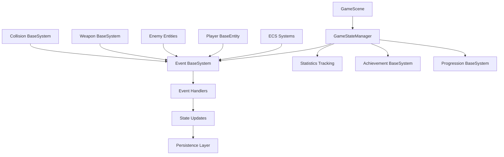
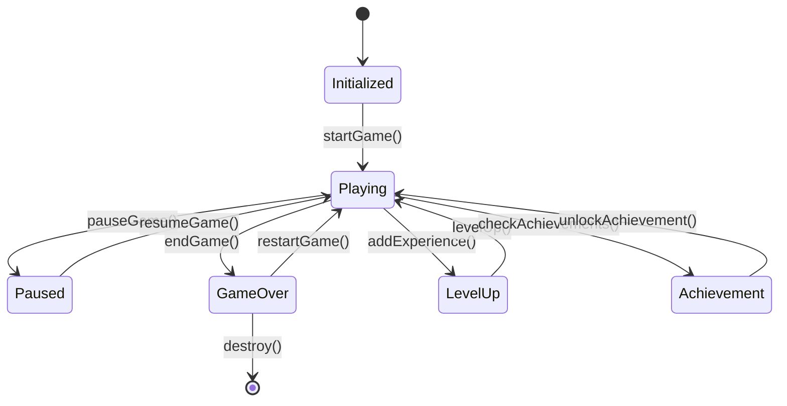
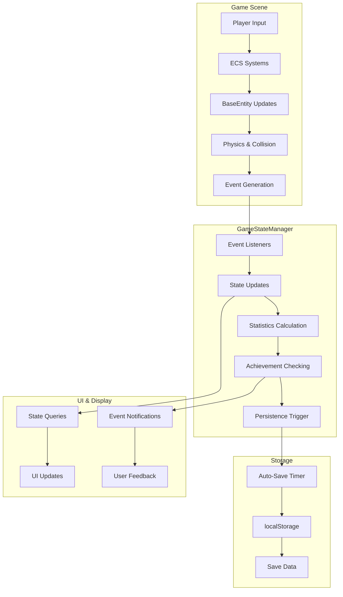
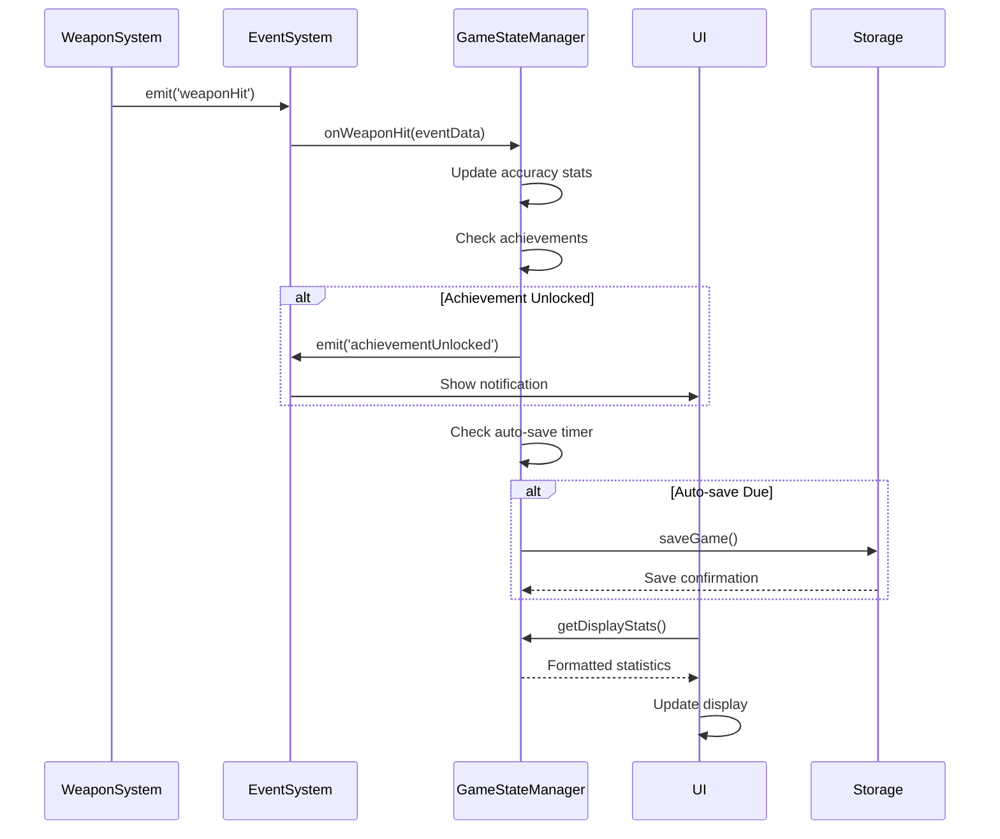
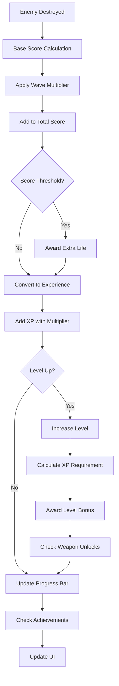
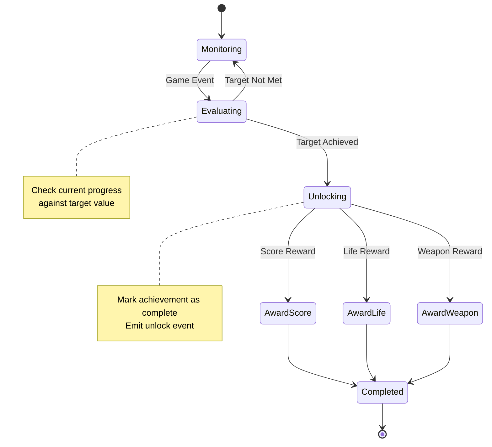

# GameStateManager Technical Documentation

## Table of Contents

1. [Overview & Purpose](#overview--purpose)
2. [Architecture & Design](#architecture--design)
3. [State Management](#state-management)
4. [Event BaseSystem Integration](#event-system-integration)
5. [Progression Systems](#progression-systems)
6. [Persistence BaseSystem](#persistence-system)
7. [Performance Tracking](#performance-tracking)
8. [API Reference](#api-reference)
9. [Usage Examples](#usage-examples)
10. [Data Flow Diagrams](#data-flow-diagrams)
11. [Integration Guide](#integration-guide)
12. [Troubleshooting](#troubleshooting)

---

## Overview & Purpose

The `GameStateManager` is a critical component of the space shooter game that serves as the central hub for all game state management, player progression, scoring, achievements, and data persistence. It acts as the single source of truth for the game's current state and provides a unified interface for tracking and managing player progress throughout the game session.

### Core Responsibilities

- **Game State Management**: Tracks current game status (playing, paused, game over)
- **Player Progress**: Manages score, lives, level progression, and experience points
- **Wave Management**: Handles wave progression and completion tracking
- **Statistics Tracking**: Comprehensive tracking of player performance metrics
- **Achievement BaseSystem**: Manages unlockable achievements and milestone tracking
- **Weapon Progression**: Handles weapon unlocks and usage statistics
- **Data Persistence**: Automatic saving and loading of game progress
- **Performance Monitoring**: Real-time FPS tracking and performance metrics
- **Event Coordination**: Central event hub for game-wide state changes

### Key Features

✅ **Event-Driven Architecture** - Responds to game events automatically  
✅ **Automatic Persistence** - Regular auto-saves with manual save/load capabilities  
✅ **Achievement BaseSystem** - Configurable milestones with rewards  
✅ **Performance Monitoring** - Built-in FPS tracking and metrics  
✅ **Level Progression** - XP-based leveling with scaling requirements  
✅ **Weapon Unlocking** - Progressive weapon unlock scopeName  
✅ **High Score Tracking** - Persistent leaderboard with detailed game records  
✅ **Real-time Statistics** - Live tracking of accuracy, streaks, and performance  

---

## Architecture & Design

### Design Patterns

The GameStateManager employs several key design patterns:

**Observer Pattern**: Listens to game events through Phaser's EventEmitter scopeName
**Singleton Pattern**: Single instance manages all game state
**Command Pattern**: Actions are processed through dedicated handler methods
**State Pattern**: Internal state machines for game phases and progression

### Integration with ECS Architecture



### Event-Driven Architecture

The GameStateManager operates as a passive observer in the event-driven architecture:

1. **Game Systems** emit events when significant actions occur
2. **GameStateManager** listens for relevant events automatically
3. **Event Handlers** process events and update internal state
4. **State Changes** trigger additional events for UI updates
5. **Persistence** occurs automatically based on state changes

### Dependencies

- **Logger**: Environment-aware logging scopeName for debugging and monitoring
- **Phaser.Scene**: Scene reference for event scopeName access
- **LocalStorage**: Browser storage for persistence
- **Date/Time APIs**: For timestamp tracking and session duration

---

## State Management

### Game State Categories

The GameStateManager tracks five primary categories of state:

#### 1. Game Session State
```javascript
{
  isPlaying: boolean,        // Currently in active gameplay
  isPaused: boolean,         // Game is paused
  isGameOver: boolean,       // Game has ended
  gameStartTime: number,     // Session start timestamp
  gameEndTime: number,       // Session end timestamp
  totalPlayTime: number      // Cumulative play time across sessions
}
```

#### 2. Player Statistics
```javascript
{
  score: number,                    // Current score
  lives: number,                    // Current lives (0-5)
  maxLives: number,                 // Maximum lives possible
  currentLevel: number,             // Player level (1+)
  experience: number,               // Current XP points
  experienceToNextLevel: number     // XP needed for next level
}
```

#### 3. Wave Progression
```javascript
{
  currentWave: number,         // Current wave number
  highestWave: number,         // Highest wave ever reached
  wavesCompleted: number,      // Waves completed this session
  enemiesDestroyed: number,    // Enemies killed this wave
  totalEnemiesDestroyed: number // Total lifetime enemy kills
}
```

#### 4. Weapon Statistics
```javascript
{
  shotsFired: number,          // Total projectiles fired
  shotsHit: number,           // Successful hits landed
  accuracy: number,           // Hit percentage (0-100)
  weaponsUnlocked: Set,       // Available weapon types
  consecutiveHits: number,    // Current hit streak
  maxConsecutiveHits: number  // Best hit streak ever
}
```

#### 5. Performance Metrics
```javascript
{
  averageFPS: number,         // Session average FPS
  minFPS: number,            // Lowest FPS recorded
  maxFPS: number,            // Highest FPS recorded
  frameCount: number,        // Total frames processed
  fpsHistory: Array         // Recent FPS samples (60 frames)
}
```

### State Transitions



---

## Event BaseSystem Integration

### Event Listening Architecture

The GameStateManager automatically subscribes to key game events during initialization:

```javascript
// Enemy and combat events
this.scene.events.on('enemyDeath', this.onEnemyDestroyed, this);
this.scene.events.on('weaponFire', this.onWeaponFire, this);
this.scene.events.on('weaponHit', this.onWeaponHit, this);

// Wave progression events
this.scene.events.on('waveStart', this.onWaveStart, this);
this.scene.events.on('waveComplete', this.onWaveComplete, this);

// Player events
this.scene.events.on('playerDamage', this.onPlayerDamage, this);
this.scene.events.on('playerDeath', this.onPlayerDeath, this);

// Power-up and progression events
this.scene.events.on('powerUpCollected', this.onPowerUpCollected, this);
this.scene.events.on('weaponUnlocked', this.onWeaponUnlocked, this);
```

### Event Handler Processing

Each event handler follows a consistent pattern:

1. **Validate Event Data** - Check for required parameters
2. **Update Internal State** - Modify relevant state properties
3. **Calculate Derived Values** - Update computed statistics
4. **Check Triggers** - Evaluate achievements and milestones
5. **Emit Response Events** - Notify other systems of changes
6. **Log Activity** - Record significant events for debugging

### Event Data Structures

#### Enemy Death Event

```javascript
{
  enemy: BaseEntity,           // Enemy entity reference
    scoreValue
:
  number,      // Base score value for enemy type
    cause
:
  string,          // 'weapon', 'collision', etc.
    position
:
  {
    x, y
  }
,       // Death location
  enemyType: string       // Enemy classification
}
```

#### Wave Events
```javascript
// Wave Start
{
  wave: number,           // Wave number starting
  enemyCount: number,     // Total enemies in wave
  difficulty: number      // Wave difficulty multiplier
}

// Wave Complete
{
  wave: number,           // Completed wave number
  enemiesKilled: number,  // Enemies destroyed
  timeElapsed: number,    // Wave duration in ms
  bonusEarned: number     // Score bonus for completion
}
```

#### Weapon Events

```javascript
// Weapon Fire
{
  weaponType: string,     // 'laser', 'plasma', 'missile'
    projectileCount
:
  number, // Projectiles spawned
    playerPosition
:
  {
    x, y
  }   // Player location at fire time
}

// Weapon Hit
{
  weaponType: string,     // Weapon that hit
    damage
:
  number,         // Damage dealt
    target
:
  BaseEntity,         // BaseEntity that was hit
    critical
:
  boolean       // Was this a critical hit
}
```

---

## Progression Systems

### Experience and Leveling

The progression scopeName uses an exponential XP curve with increasing requirements:

```javascript
// XP required for next level increases by 20% each level
this.experienceToNextLevel = Math.floor(this.experienceToNextLevel * 1.2);

// Base XP gain formula
const baseXP = scoreValue * 0.1; // 10% of score value
const modifiedXP = Math.floor(baseXP * this.experienceMultiplier);
```

#### Level Benefits

- **Score Bonus**: 1000 × level points awarded on level up
- **Weapon Unlocks**: Specific weapons unlock at predetermined levels
- **Increased Multipliers**: Higher levels provide better score/XP multipliers

### Weapon Unlock BaseSystem

Weapons unlock through multiple pathways:

```javascript
const weaponUnlocks = {
  3: 'plasma',    // Level 3: Plasma cannon
  7: 'missile',   // Level 7: Missile launcher
};

// Achievement-based unlocks
milestones.set('sharpshooter', {
  target: 10,           // 10 consecutive hits
  reward: 'weapon',
  value: 'plasma'       // Early plasma unlock
});
```

### Achievement BaseSystem

#### Achievement Categories

1. **Combat Achievements**
   - First Kill: Destroy first enemy
   - Sharpshooter: 10 consecutive hits
   - Destroyer: 100 total enemy kills

2. **Survival Achievements**
   - Survivor: Complete 5 waves
   - Wave Master: Complete 10 waves

3. **Skill Achievements**
   - Accuracy: Maintain 80% hit rate

#### Achievement Rewards

```javascript
// Reward types available
switch (milestone.reward) {
  case 'score':
    this.addScore(milestone.value);  // Immediate score bonus
    break;
  case 'life':
    this.addLife();                  // Extra life granted
    break;
  case 'weapon':
    this.weaponsUnlocked.add(milestone.value); // Weapon unlock
    break;
}
```

### Score Multipliers

Dynamic multipliers enhance progression:

- **Wave Multiplier**: `1.0 + (wave - 1) * 0.05`
- **Experience Multiplier**: Applied to XP gains
- **Consecutive Hit Bonus**: Builds with unbroken hit streaks

---

## Persistence BaseSystem

### Auto-Save Mechanism

The GameStateManager implements intelligent auto-saving:

```javascript
// Auto-save every 30 seconds during gameplay
this.autoSaveInterval = 30000;

// Triggered during update loop
if (now - this.lastAutoSave >= this.autoSaveInterval) {
  this.saveGame();
  this.lastAutoSave = now;
}
```

### Save Data Structure

#### Persistent Data
```javascript
{
  // Player progression (survives game restart)
  level: number,
  totalEnemiesDestroyed: number,
  weaponsUnlocked: Array<string>,
  achievements: Array<string>,
  highestWave: number,
  totalPlayTime: number,
  
  // High scores leaderboard
  highScores: Array<{
    score: number,
    wave: number,
    level: number,
    accuracy: number,
    enemiesDestroyed: number,
    playTime: number,
    date: string
  }>,
  
  // Metadata
  lastPlayed: number,
  version: string
}
```

#### Session Data (Reset on Restart)
- Current score, lives, wave progress
- Current session statistics
- Temporary multipliers and streaks

### Data Integrity

The persistence scopeName includes several integrity measures:

```javascript
// Error handling for localStorage failures
try {
  localStorage.setItem(this.saveKey, JSON.stringify(data));
  Logger.debug('Game saved successfully');
} catch (error) {
  Logger.error('Failed to save game:', error);
  // Graceful fallback - game continues without save
}

// Validation on load
if (data.level) this.currentLevel = data.level;
if (data.weaponsUnlocked) this.weaponsUnlocked = new Set(data.weaponsUnlocked);
```

### Save Triggers

Automatic saves occur on:
- Game over (final state)
- Achievement unlocks
- Level progression
- Timed intervals (30 seconds)
- Manual save requests

---

## Performance Tracking

### FPS Monitoring

Real-time performance tracking with statistical analysis:

```javascript
updatePerformance(fps) {
  this.performanceMetrics.frameCount++;
  this.performanceMetrics.fpsHistory.push(fps);
  
  // Maintain rolling window of 60 frames
  if (this.performanceMetrics.fpsHistory.length > 60) {
    this.performanceMetrics.fpsHistory.shift();
  }
  
  // Calculate statistics
  this.performanceMetrics.averageFPS = 
    this.performanceMetrics.fpsHistory.reduce((a, b) => a + b, 0) / 
    this.performanceMetrics.fpsHistory.length;
    
  this.performanceMetrics.minFPS = Math.min(this.performanceMetrics.minFPS, fps);
  this.performanceMetrics.maxFPS = Math.max(this.performanceMetrics.maxFPS, fps);
}
```

### Performance Metrics

- **Average FPS**: Rolling 60-frame average for smooth display
- **Min/Max FPS**: Session extremes for performance analysis
- **Frame Count**: Total frames processed since initialization
- **FPS History**: Recent frame rate samples for trend analysis

### Integration with Game Loop

Performance monitoring integrates seamlessly with the game update cycle:

```javascript
update(delta) {
  if (!this.isPlaying || this.isPaused) return;
  
  // Calculate approximate FPS from delta time
  const fps = 1000 / delta;
  this.updatePerformance(fps);
  
  // Other update tasks...
}
```

---

## API Reference

### Constructor

#### `new GameStateManager(scene)`

Creates a new game state manager instance.

**Parameters:**
- `scene` (Phaser.Scene): The game scene that owns this manager

**Example:**
```javascript
const gameStateManager = new GameStateManager(this);
```

### Game Control Methods

#### `startGame()`

Initiates a new game session.

**Returns:** `void`

**Side Effects:**
- Sets `isPlaying = true`
- Records start timestamp
- Resets wave and enemy counters
- Emits 'gameStart' event

#### `pauseGame()`

Pauses the current game session.

**Returns:** `void`

**Conditions:** Only works if currently playing and not game over

#### `resumeGame()`

Resumes a paused game session.

**Returns:** `void`

**Conditions:** Only works if currently paused

#### `endGame(reason = 'player_death')`

Terminates the current game session.

**Parameters:**
- `reason` (string): Reason for game ending ('player_death', 'no_lives', etc.)

**Side Effects:**
- Updates high scores
- Triggers auto-save
- Emits 'gameOver' event

#### `restartGame()`

Resets session progress while preserving permanent unlocks.

**Returns:** `void`

**Preserves:** Level, weapons, achievements, high scores
**Resets:** Score, lives, wave progress, session statistics

### Score and Experience Methods

#### `addScore(points)`

Adds points to the current score with validation.

**Parameters:**
- `points` (number): Points to add (must be > 0)

**Side Effects:**
- Checks for extra life thresholds (every 50,000 points)
- Triggers life awards if applicable

#### `addExperience(exp)`

Adds experience points and handles level progression.

**Parameters:**
- `exp` (number): Experience points to add (must be > 0)

**Side Effects:**
- Automatically processes level ups if XP threshold reached
- Triggers weapon unlock checks
- Emits 'levelUp' events

#### `addLife()`

Awards an extra life if under maximum.

**Returns:** `void`

**Conditions:** Only adds life if `lives < maxLives`

### State Query Methods

#### `getGameState()`

Returns comprehensive current game state.

**Returns:** `Object` - Complete state snapshot including:
- Game status flags
- Player statistics
- Progress indicators
- Weapon and achievement data
- Performance metrics

#### `getDisplayStats()`

Returns formatted statistics for UI display.

**Returns:** `Object` - User-friendly formatted stats:
```javascript
{
  score: "1,234,567",        // Comma-formatted score
  lives: 3,                  // Current lives
  level: 5,                  // Player level
  wave: 12,                  // Current wave
  accuracy: "85.2%",         // Formatted accuracy
  consecutiveHits: 15,       // Current hit streak
  powerUps: 8,              // Power-ups collected
  fps: 60                   // Rounded average FPS
}
```

### Event Handler Methods

All event handlers are internal methods automatically called by the event scopeName:

#### `onEnemyDestroyed(eventData)`
Processes enemy death events, updating score, XP, and statistics.

#### `onWaveStart(eventData)`
Handles wave initiation, updating multipliers and counters.

#### `onWaveComplete(eventData)`
Processes wave completion, awarding bonuses and checking achievements.

#### `onPlayerDamage(eventData)`
Responds to player damage, resetting hit streaks.

#### `onPlayerDeath()`
Handles player death, managing lives and game over conditions.

#### `onWeaponFire()` / `onWeaponHit()`
Track weapon usage and accuracy statistics.

#### `onPowerUpCollected(eventData)`
Records power-up collection and awards bonuses.

### Persistence Methods

#### `saveGame()`

Manually saves current progress to localStorage.

**Returns:** `void`

**Data Saved:** Persistent progression data only (not session data)

#### `loadGame()`

Loads saved progress from localStorage.

**Returns:** `Object` - Loaded save data or empty object if none found

**Side Effects:** Applies loaded data to current state

#### `resetProgress()`

Completely resets all saved progress (debug/new player function).

**Returns:** `void`

**Warning:** Irreversibly deletes all save data

### Utility Methods

#### `updatePerformance(fps)`

Updates performance metrics with current frame rate.

**Parameters:**
- `fps` (number): Current frames per second

#### `checkAchievements()`

Evaluates all achievement milestones against current progress.

**Returns:** `void`

**Side Effects:** May unlock achievements and emit events

#### `destroy()`

Cleans up event listeners and performs final save.

**Returns:** `void`

**Usage:** Call when GameStateManager is no longer needed

---

## Usage Examples

### Basic Integration

```javascript
// In GameScene.create()
class GameScene extends Phaser.Scene {
  create() {
    // Initialize GameStateManager
    this.gameStateManager = new GameStateManager(this);
    
    // Load any saved progress
    this.gameStateManager.loadGame();
    
    // Set up UI update listener
    this.events.on('gameStateUpdate', (state) => {
      this.updateUI(state);
    });
    
    // Start the game
    this.gameStateManager.startGame();
  }
  
  update(time, delta) {
    // Update performance tracking
    this.gameStateManager.update(delta);
  }
}
```

### Event Emission Integration

```javascript
// In WeaponSystem.js
class WeaponSystem {
  fireWeapon(weapon, target) {
    // Fire weapon logic...
    
    // Notify GameStateManager
    this.scene.events.emit('weaponFire', {
      weaponType: weapon.type,
      projectileCount: 1,
      playerPosition: { x: weapon.x, y: weapon.y }
    });
  }
  
  onProjectileHit(projectile, enemy) {
    // Handle collision...
    
    // Notify of hit
    this.scene.events.emit('weaponHit', {
      weaponType: projectile.weaponType,
      damage: projectile.damage,
      target: enemy,
      critical: false
    });
    
    // If enemy destroyed
    if (enemy.health <= 0) {
      this.scene.events.emit('enemyDeath', {
        enemy: enemy,
        scoreValue: enemy.scoreValue,
        cause: 'weapon',
        position: { x: enemy.x, y: enemy.y },
        enemyType: enemy.enemyType
      });
    }
  }
}
```

### UI Integration

```javascript
// In GameScene UI update
updateUI() {
  const stats = this.gameStateManager.getDisplayStats();
  const state = this.gameStateManager.getGameState();
  
  // Update score display
  this.scoreText.setText(`Score: ${stats.score}`);
  
  // Update lives display
  this.livesText.setText(`Lives: ${stats.lives}`);
  
  // Update level progress
  const progressPercent = (state.experience / state.experienceToNextLevel) * 100;
  this.experienceBar.setScale(progressPercent / 100, 1);
  
  // Update weapon unlock notifications
  if (state.weaponsUnlocked.length > this.lastWeaponCount) {
    this.showWeaponUnlockNotification();
  }
}
```

### Achievement BaseSystem Usage

```javascript
// Custom achievement setup
this.gameStateManager.milestones.set('customAchievement', {
  target: 50,              // Target value
  current: 0,              // Current progress
  achieved: false,         // Achievement status
  reward: 'score',         // Reward type
  value: 10000            // Reward value
});

// Check achievements after significant events
this.events.on('specialEvent', () => {
  this.gameStateManager.checkAchievements();
});
```

### Save/Load Implementation

```javascript
// Manual save on game pause
pauseGame() {
  this.gameStateManager.pauseGame();
  this.gameStateManager.saveGame(); // Manual save
}

// Load progress on scene start
init() {
  this.gameStateManager = new GameStateManager(this);
  const saveData = this.gameStateManager.loadGame();
  
  if (saveData.level) {
    console.log(`Welcome back, Level ${saveData.level} player!`);
  }
}
```

### Performance Monitoring

```javascript
// Display performance metrics in debug UI
showDebugInfo() {
  const perf = this.gameStateManager.performanceMetrics;
  
  this.debugText.setText([
    `FPS: ${Math.round(perf.averageFPS)}`,
    `Min: ${Math.round(perf.minFPS)}`,
    `Max: ${Math.round(perf.maxFPS)}`,
    `Frames: ${perf.frameCount}`
  ].join('\n'));
}
```

---

## Data Flow Diagrams

### Overall BaseSystem Architecture



### Event Processing Flow



### Score and Progression Flow



### Achievement BaseSystem Flow



---

## Integration Guide

### Scene Integration

#### 1. Initialization
```javascript
class GameScene extends Phaser.Scene {
  create() {
    // IMPORTANT: Initialize after event scopeName is ready
    this.gameStateManager = new GameStateManager(this);
    
    // Load saved progress
    this.gameStateManager.loadGame();
    
    // Continue with scene setup...
  }
}
```

#### 2. Update Loop Integration
```javascript
update(time, delta) {
  // Update GameStateManager first
  this.gameStateManager.update(delta);
  
  // Then update other systems
  Object.values(this.systems).forEach(scopeName => {
    scopeName.update(this.entities, delta);
  });
}
```

### BaseSystem Integration

#### ECS BaseSystem Events
Each scopeName should emit appropriate events:

```javascript
// In CollisionSystem
onEnemyDestroyed(enemy) {
  this.scene.events.emit('enemyDeath', {
    enemy: enemy,
    scoreValue: enemy.scoreValue || 100,
    cause: 'collision',
    position: { x: enemy.x, y: enemy.y },
    enemyType: enemy.enemyType || 'basic'
  });
}

// In WeaponSystem  
onProjectileFired(weapon) {
  this.scene.events.emit('weaponFire', {
    weaponType: weapon.type,
    projectileCount: 1,
    playerPosition: { x: weapon.x, y: weapon.y }
  });
}
```

#### UI BaseSystem Integration
```javascript
class UIManager {
  constructor(scene, gameStateManager) {
    this.scene = scene;
    this.gameStateManager = gameStateManager;
    
    // Listen for state changes
    this.scene.events.on('gameStateUpdate', this.updateDisplay, this);
    this.scene.events.on('levelUp', this.showLevelUpEffect, this);
    this.scene.events.on('achievementUnlocked', this.showAchievement, this);
  }
  
  updateDisplay() {
    const stats = this.gameStateManager.getDisplayStats();
    // Update UI elements with stats
  }
}
```

### Event Contract

All systems must follow the event data contracts:

#### Required Event Data Structures

```javascript
// Enemy death events MUST include:
{
  enemy: BaseEntity,          // REQUIRED: Enemy entity reference
    scoreValue
:
  number,     // REQUIRED: Base score for enemy type
    cause
:
  string,          // REQUIRED: 'weapon', 'collision', etc.
    position
:
  {
    x, y
  }
,       // REQUIRED: Death position
  enemyType: string       // REQUIRED: Enemy classification
}

// Weapon events MUST include:
{
  weaponType: string      // REQUIRED: Weapon identifier
  // Additional fields optional but recommended
}
```

### Error Handling

The GameStateManager includes comprehensive error handling:

```javascript
// Event listener setup with error handling
try {
  this.scene.events.on('enemyDeath', this.onEnemyDestroyed, this);
  Logger.debug('Event listeners set up successfully');
} catch (error) {
  Logger.error('Failed to setup event listeners:', error);
  // Graceful fallback - manager continues to function
}

// localStorage operations with fallbacks
try {
  localStorage.setItem(this.saveKey, JSON.stringify(data));
} catch (error) {
  Logger.error('Save failed:', error);
  // Game continues without persistence
}
```

---

## Troubleshooting

### Common Issues

#### 1. Events Not Being Received

**Symptoms:** GameStateManager not responding to game events

**Causes:**
- Event scopeName not initialized when GameStateManager created
- Incorrect event names being emitted
- Missing required event data fields

**Solutions:**
```javascript
// ✅ Correct: Initialize in create() after event scopeName ready
create() {
  this.gameStateManager = new GameStateManager(this);
}

// ❌ Wrong: Initialize in init() before event scopeName
init() {
  this.gameStateManager = new GameStateManager(this); // Too early!
}

// ✅ Verify event names match exactly
this.scene.events.emit('enemyDeath', eventData); // Correct name
this.scene.events.emit('enemyDestroyed', eventData); // Wrong name
```

#### 2. Save/Load Failures

**Symptoms:** Progress not persisting between sessions

**Causes:**
- localStorage quota exceeded
- Invalid JSON data structure
- Browser privacy settings blocking localStorage

**Solutions:**
```javascript
// Check localStorage availability
if (typeof(Storage) !== "undefined") {
  // localStorage supported
} else {
  Logger.warn('localStorage not supported');
}

// Validate save data before storing
const validateSaveData = (data) => {
  return data && 
         typeof data.level === 'number' &&
         Array.isArray(data.weaponsUnlocked);
};
```

#### 3. Performance Issues

**Symptoms:** FPS drops, UI stuttering

**Causes:**
- Excessive event processing
- Large FPS history arrays
- Frequent localStorage writes

**Solutions:**
```javascript
// Throttle performance updates
if (this.performanceMetrics.frameCount % 10 === 0) {
  this.updatePerformance(fps);
}

// Limit auto-save frequency
this.autoSaveInterval = 60000; // Increase to 60 seconds
```

#### 4. Achievement BaseSystem Issues

**Symptoms:** Achievements not unlocking properly

**Causes:**
- Incorrect milestone target values
- Missing achievement checks after events
- Wrong progress tracking variables

**Solutions:**
```javascript
// Debug achievement progress
checkAchievements() {
  this.milestones.forEach((milestone, name) => {
    Logger.debug(`${name}: ${milestone.current}/${milestone.target}`);
  });
}

// Verify achievement triggers
onEnemyDestroyed(eventData) {
  // Update stats
  this.enemiesDestroyed++;
  
  // IMPORTANT: Always check achievements after stat updates
  this.checkAchievements();
}
```

### Debug Tools

#### 1. State Inspection
```javascript
// Add to browser console for debugging
window.debugGameState = () => {
  console.log(gameScene.gameStateManager.getGameState());
};

// In-game debug display
if (this.debugMode) {
  const state = this.gameStateManager.getGameState();
  this.add.text(10, 10, `Level: ${state.level}\nScore: ${state.score}`, {
    fontSize: '16px'
  });
}
```

#### 2. Event Monitoring
```javascript
// Log all events in debug mode
if (Environment.DEBUG_MODE) {
  const originalEmit = this.events.emit;
  this.events.emit = function(event, ...args) {
    Logger.debug(`Event: ${event}`, args);
    return originalEmit.call(this, event, ...args);
  };
}
```

#### 3. Achievement Testing
```javascript
// Force unlock achievement for testing
this.gameStateManager.unlockAchievement('testAchievement', {
  achieved: false,
  reward: 'score',
  value: 1000
});

// Reset specific achievement
this.gameStateManager.milestones.get('firstKill').achieved = false;
this.gameStateManager.milestones.get('firstKill').current = 0;
```

### Performance Optimization

#### 1. Event Processing
- Batch related state updates
- Avoid excessive event emissions
- Use debouncing for rapid events

#### 2. Persistence
- Increase auto-save intervals in production
- Compress save data for large datasets
- Implement incremental saves for large states

#### 3. Statistics Tracking  
- Limit history array sizes
- Use rolling averages instead of storing all data points
- Cache expensive calculations

---

## Conclusion

The GameStateManager serves as the backbone of the space shooter game's progression and persistence systems. Its event-driven architecture, comprehensive state tracking, and robust error handling make it a critical component for maintaining game integrity and player engagement.

Key benefits of this architecture:

- **Centralized State**: Single source of truth for all game progress
- **Event-Driven**: Automatic response to game events without tight coupling
- **Persistent Progress**: Reliable save/load with graceful error handling
- **Performance Monitoring**: Built-in FPS tracking and optimization detection
- **Extensible Achievement BaseSystem**: Easy to add new achievements and rewards
- **Debug-Friendly**: Comprehensive logging and state inspection capabilities

For developers working with this scopeName, focus on proper event emission with complete data structures, and always test the integration thoroughly with the event scopeName to ensure reliable state management throughout the game lifecycle.