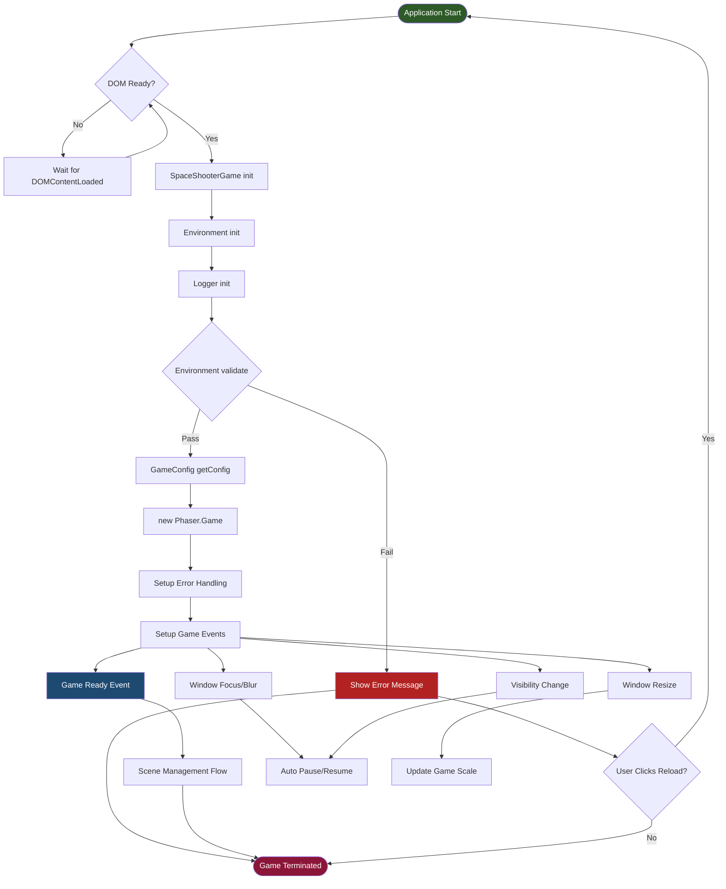
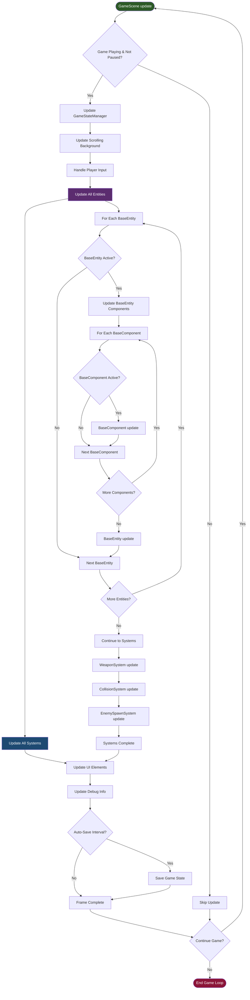
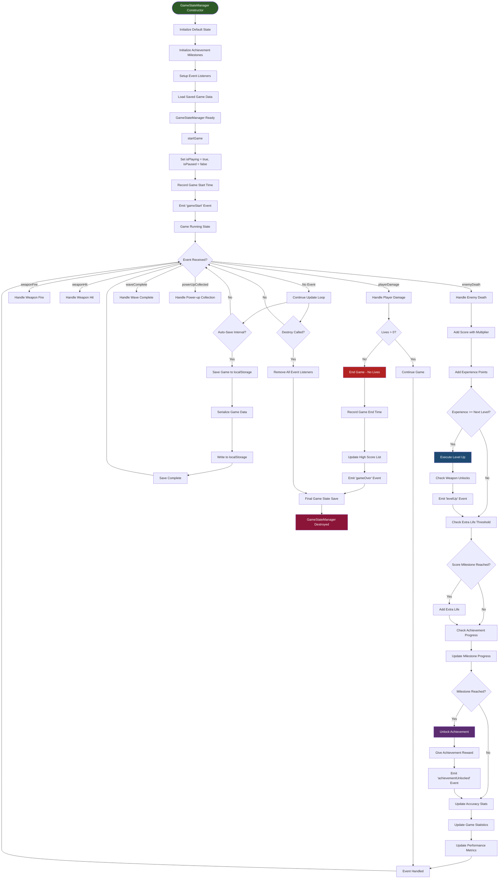
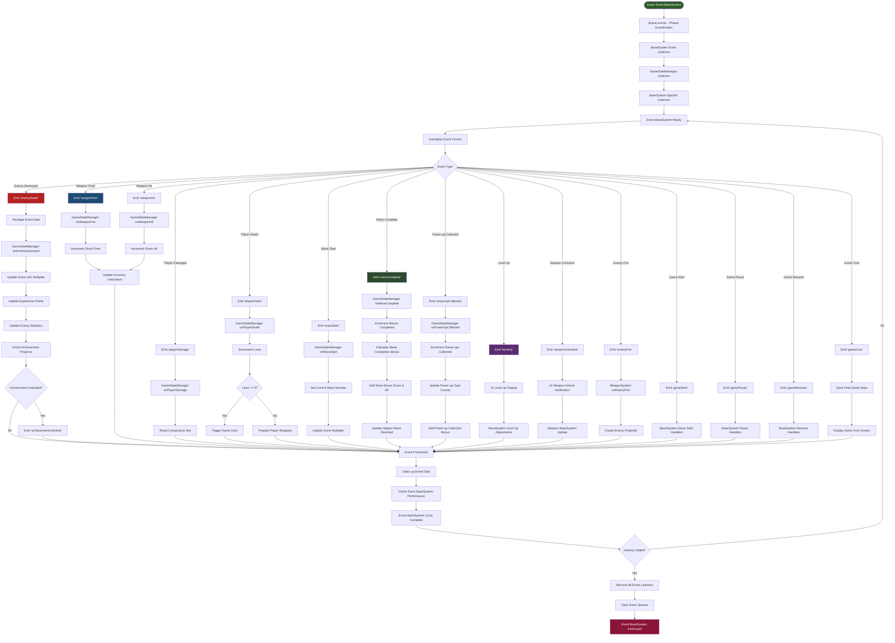

# Space Shooter Game BaseSystem Flow Diagram

This document contains comprehensive flow diagrams for the space shooter game system, showing how all components interact throughout the game lifecycle.

## 1. Main BaseSystem Overview



## 2. Scene Management Flow

```mermaid
flowchart TD
    %% Scene Initialization
    GameStart([Game Initialization]) --> BootScene[BootScene]
    BootScene --> BootInit[Initialize Environment & Logger]
    BootInit --> PreloaderScene[PreloaderScene]
    
    %% Preloader Scene
    PreloaderScene --> LoadAssets[Load Assets & Dev Graphics]
    LoadAssets --> AssetsReady{Assets Ready?}
    AssetsReady -->|No| LoadingScreen[Show Loading Progress]
    LoadingScreen --> AssetsReady
    AssetsReady -->|Yes| MainMenuScene[MainMenuScene]
    
    %% Main Menu Scene
    MainMenuScene --> MenuDisplay[Display Menu Options]
    MenuDisplay --> MenuInput{User Input}
    MenuInput -->|Start Game| StartTransition[Scene Transition]
    MenuInput -->|Quit| QuitGame[Quit Game]
    MenuInput -->|Settings| SettingsMenu[Settings Menu]
    
    %% Game Scene Transition
    StartTransition --> FadeOut[Fade Out Menu]
    FadeOut --> GameScene[GameScene]
    
    %% Game Scene Initialization
    GameScene --> GameInit[GameScene init]
    GameInit --> CreateGSM[Create GameStateManager]
    CreateGSM --> LoadSavedGame[Load Saved Progress]
    LoadSavedGame --> CreateBackground[Create Background]
    CreateBackground --> SetupPhysics[Setup Physics Groups]
    SetupPhysics --> CreatePlayer[Create Player BaseEntity]
    CreatePlayer --> InitSystems[Initialize All Systems]
    InitSystems --> CreateUI[Create UI Elements]
    CreateUI --> SetupInput[Setup Input Handlers]
    SetupInput --> FadeIn[Fade In Game Scene]
    FadeIn --> StartGame[Start Game Loop]
    
    %% Game Over Flow
    StartGame --> GameLoop[Main Game Loop]
    GameLoop --> GameOver{Game Over?}
    GameOver -->|No| GameLoop
    GameOver -->|Yes| GameOverScreen[Show Game Over Screen]
    GameOverScreen --> SaveFinalState[Save Final Game State]
    SaveFinalState --> ReturnMenu{Return to Menu?}
    ReturnMenu -->|Yes| MainMenuScene
    ReturnMenu -->|No| QuitGame
    
    %% Scene Cleanup
    QuitGame --> Cleanup[Scene Cleanup]
    Cleanup --> DestroyGSM[Destroy GameStateManager]
    DestroyGSM --> CleanupEntities[Cleanup Entities]
    CleanupEntities --> CleanupSystems[Cleanup Systems]
    CleanupSystems --> RemoveListeners[Remove Event Listeners]
    RemoveListeners --> GameEnd([Game End])
    
    style GameStart fill:#2d5a27,color:#ffffff
    style GameEnd fill:#8b1538,color:#ffffff
    style GameLoop fill:#1e4a72,color:#ffffff
    style GameOverScreen fill:#5b2c6f,color:#ffffff
```



## 3. Core Game Loop & ECS Flow



## 4. ECS Architecture Flow

```mermaid
flowchart TD
    %% BaseEntity Creation
    CreateEntity([Create BaseEntity]) --> EntityConstructor[BaseEntity Constructor]
    EntityConstructor --> GenerateID[Generate Unique BaseEntity ID]
    GenerateID --> AddToScene[Add to Scene Display List]
    AddToScene --> RegisterEntity[Register in Scene.entities Array]
    RegisterEntity --> EntityReady[BaseEntity Ready for Components]
    
    %% BaseComponent Management
    EntityReady --> AddComponent[Add BaseComponent]
    AddComponent --> ComponentConstructor[BaseComponent Constructor]
    ComponentConstructor --> SetEntityRef[Set component.entity Reference]
    SetEntityRef --> StoreComponent[Store in BaseEntity.components Map]
    StoreComponent --> ComponentReady[BaseComponent Ready]
    
    %% BaseSystem Processing
    ComponentReady --> SystemUpdate[BaseSystem update]
    SystemUpdate --> QueryEntities[Query Entities by Components]
    QueryEntities --> FilterComponents[Filter by Required Components]
    FilterComponents --> ProcessEntity[Process Each Matching BaseEntity]
    ProcessEntity --> GetComponents[Get Required Components]
    GetComponents --> ExecuteLogic[Execute BaseSystem Logic]
    ExecuteLogic --> UpdateComponents[Update BaseComponent Data]
    UpdateComponents --> NextEntity{More Entities?}
    NextEntity -->|Yes| ProcessEntity
    NextEntity -->|No| SystemComplete[BaseSystem Update Complete]
    
    %% BaseComponent Communication
    ExecuteLogic --> EmitEvent[Emit Event for Cross-BaseSystem Communication]
    EmitEvent --> EventBus[Scene Event Bus]
    EventBus --> OtherSystems[Other Systems Listen]
    OtherSystems --> HandleEvent[Handle Event]
    HandleEvent --> UpdateComponents
    
    %% BaseEntity Destruction
    SystemComplete --> EntityDestroy{Destroy BaseEntity?}
    EntityDestroy -->|No| ContinueLoop[Continue Game Loop]
    EntityDestroy -->|Yes| CleanupComponents[Cleanup All Components]
    CleanupComponents --> ClearEntityRefs[Clear BaseEntity References]
    ClearEntityRefs --> RemoveFromScene[Remove from Scene]
    RemoveFromScene --> PhaserDestroy[Call Phaser destroy]
    PhaserDestroy --> EntityDestroyed[BaseEntity Destroyed]
    
    %% Physics Integration
    AddComponent --> EnablePhysics{Enable Physics?}
    EnablePhysics -->|Yes| CreatePhysicsBody[Create Arcade Physics Body]
    CreatePhysicsBody --> ConfigureBody[Configure Body Type]
    ConfigureBody --> AddToPhysicsGroup[Add to Physics Group]
    AddToPhysicsGroup --> ComponentReady
    EnablePhysics -->|No| ComponentReady
    
    ContinueLoop --> CreateEntity
    EntityDestroyed --> ContinueLoop
    
    style CreateEntity fill:#2d5a27,color:#ffffff
    style EntityDestroyed fill:#8b1538,color:#ffffff
    style ExecuteLogic fill:#1e4a72,color:#ffffff
    style EventBus fill:#5b2c6f,color:#ffffff
```



## 5. Game State Management Flow



## 6. Weapon BaseSystem Flow

```mermaid
flowchart TD
    %% BaseSystem Initialization
    WeaponStart([WeaponSystem Constructor]) --> InitializePools[Initialize Projectile Pools]
    InitializePools --> CreatePlayerPool[Create Player Projectile Pool]
    CreatePlayerPool --> CreateEnemyPool[Create Enemy Projectile Pool]
    CreateEnemyPool --> SetupInputHandlers[Setup Input Handlers]
    SetupInputHandlers --> WeaponReady[Weapon BaseSystem Ready]
    
    %% Input Processing
    WeaponReady --> UpdateInput[Process Input]
    UpdateInput --> InputCheck{Input Check Interval?}
    InputCheck -->|No| SkipInput[Skip Input Processing]
    InputCheck -->|Yes| FindPlayer[Find Player BaseEntity]
    FindPlayer --> PlayerFound{Player Found?}
    PlayerFound -->|No| SkipInput
    PlayerFound -->|Yes| GetWeaponComponent[Get WeaponComponent]
    GetWeaponComponent --> WeaponSwitch{Weapon Switch Key?}
    WeaponSwitch -->|Yes| SwitchWeapon[Switch to Selected Weapon]
    WeaponSwitch -->|No| CheckFire[Check Fire Key]
    SwitchWeapon --> CheckFire
    CheckFire --> FirePressed{Fire Key Down?}
    FirePressed -->|No| StopFiring[Stop Firing]
    FirePressed -->|Yes| FireWeapon[Fire Player Weapon]
    
    %% Weapon Firing Process
    FireWeapon --> ValidatePlayer{Valid Player BaseEntity?}
    ValidatePlayer -->|No| FireError[Log Error & Return]
    ValidatePlayer -->|Yes| GetWeapon[Get WeaponComponent]
    GetWeapon --> WeaponFire[weapon fire]
    WeaponFire --> ProjectileConfig{Valid Config?}
    ProjectileConfig -->|No| CooldownOrAmmo[Weapon on Cooldown/No Ammo]
    ProjectileConfig -->|Yes| CalculateFirePos[Calculate Fire Position]
    CalculateFirePos --> CreateProjectile[Create Player Projectile]
    
    %% Projectile Creation
    CreateProjectile --> GetFromPool[Try Get from Pool]
    GetFromPool --> PoolAvailable{Pool Has Available?}
    PoolAvailable -->|Yes| ConfigureFromPool[Configure Pooled Projectile]
    PoolAvailable -->|No| CreateNew[Create New Projectile]
    CreateNew --> PoolMiss[Increment Pool Miss Counter]
    PoolMiss --> ConfigureNew[Configure New Projectile]
    ConfigureFromPool --> ValidateProjectile{Valid Projectile?}
    ConfigureNew --> ValidateProjectile
    ValidateProjectile -->|No| ProjectileFailed[Projectile Creation Failed]
    ValidateProjectile -->|Yes| FireProjectile[Fire Projectile]
    FireProjectile --> SetDirection[Set Fire Direction (-π/2)]
    SetDirection --> EmitWeaponFire[Emit 'weaponFire' Event]
    EmitWeaponFire --> IncrementStats[Increment Fire Statistics]
    IncrementStats --> ProjectileActive[Projectile Active]
    
    %% Projectile Updates
    ProjectileActive --> UpdateProjectiles[Update All Projectiles]
    UpdateProjectiles --> PlayerProjectileLoop[For Each Player Projectile]
    PlayerProjectileLoop --> ProjectileActiveCheck{Projectile Active?}
    ProjectileActiveCheck -->|No| NextProjectile[Next Projectile]
    ProjectileActiveCheck -->|Yes| UpdateProjectile[projectile update]
    UpdateProjectile --> OffScreenCheck{Off-Screen?}
    OffScreenCheck -->|Yes| ReturnToPool[Return to Pool]
    OffScreenCheck -->|No| ProjectileStillActive[Projectile Still Active]
    ReturnToPool --> NextProjectile
    ProjectileStillActive --> NextProjectile
    NextProjectile --> MoreProjectiles{More Projectiles?}
    MoreProjectiles -->|Yes| PlayerProjectileLoop
    MoreProjectiles -->|No| EnemyProjectileLoop[Process Enemy Projectiles]
    
    %% Enemy Projectile Processing
    EnemyProjectileLoop --> EnemyProjectileActive{Enemy Projectile Active?}
    EnemyProjectileActive -->|No| NextEnemyProjectile[Next Enemy Projectile]
    EnemyProjectileActive -->|Yes| UpdateEnemyProjectile[Update Enemy Projectile]
    UpdateEnemyProjectile --> EnemyOffScreenCheck{Off-Screen?}
    EnemyOffScreenCheck -->|Yes| ReturnEnemyToPool[Return to Enemy Pool]
    EnemyOffScreenCheck -->|No| EnemyProjectileStillActive[Enemy Projectile Still Active]
    ReturnEnemyToPool --> NextEnemyProjectile
    EnemyProjectileStillActive --> NextEnemyProjectile
    NextEnemyProjectile --> MoreEnemyProjectiles{More Enemy Projectiles?}
    MoreEnemyProjectiles -->|Yes| EnemyProjectileLoop
    MoreEnemyProjectiles -->|No| UpdateSystemStats[Update BaseSystem Statistics]
    
    %% Statistics & Cleanup
    UpdateSystemStats --> CountActiveProjectiles[Count Active Projectiles]
    CountActiveProjectiles --> UpdateEfficiencyStats[Update Pool Efficiency]
    UpdateEfficiencyStats --> WeaponSystemComplete[Weapon BaseSystem Update Complete]
    
    %% Error Handling & Cleanup
    FireError --> WeaponSystemComplete
    CooldownOrAmmo --> WeaponSystemComplete
    ProjectileFailed --> WeaponSystemComplete
    StopFiring --> WeaponSystemComplete
    SkipInput --> UpdateProjectiles
    
    %% BaseSystem Destruction
    WeaponSystemComplete --> DestroyCheck{Destroy Called?}
    DestroyCheck -->|No| WeaponReady
    DestroyCheck -->|Yes| ClearAllProjectiles[Clear All Projectiles]
    ClearAllProjectiles --> RemoveInputListeners[Remove Input Listeners]
    RemoveInputListeners --> DestroyPools[Destroy Projectile Pools]
    DestroyPools --> WeaponSystemDestroyed[Weapon BaseSystem Destroyed]
    
    style WeaponStart fill:#2d5a27,color:#ffffff
    style WeaponSystemDestroyed fill:#8b1538,color:#ffffff
    style FireProjectile fill:#1e4a72,color:#ffffff
    style CreateProjectile fill:#5b2c6f,color:#ffffff
    style UpdateProjectiles fill:#2d4a2d,color:#ffffff
```

## 7. Collision BaseSystem Flow

```mermaid
flowchart TD
    %% Collision BaseSystem Initialization
    CollisionStart([CollisionSystem Constructor]) --> SetupPhysicsGroups[Setup Physics Groups]
    SetupPhysicsGroups --> CreateColliders[Create Phaser Colliders]
    CreateColliders --> PlayerEnemyCollider[Player ↔ Enemy Collider]
    PlayerEnemyCollider --> PlayerEnemyProjectileCollider[Player ↔ Enemy Projectile Collider]
    PlayerEnemyProjectileCollider --> PlayerProjectileEnemyCollider[Player Projectile ↔ Enemy Collider]
    PlayerProjectileEnemyCollider --> PlayerPowerUpCollider[Player ↔ Power-up Collider]
    PlayerPowerUpCollider --> CollisionReady[Collision BaseSystem Ready]
    
    %% Collision Detection Loop
    CollisionReady --> CollisionUpdate[CollisionSystem update]
    CollisionUpdate --> ProcessCollisions[Process Active Collisions]
    ProcessCollisions --> PlayerEnemyCheck[Check Player-Enemy Collisions]
    PlayerEnemyCheck --> PlayerEnemyHit{Collision Detected?}
    PlayerEnemyHit -->|No| PlayerProjectileCheck[Check Player Projectile Collisions]
    PlayerEnemyHit -->|Yes| HandlePlayerEnemyCollision[Handle Player-Enemy Collision]
    
    %% Player-Enemy Collision
    HandlePlayerEnemyCollision --> CheckPlayerInvulnerable{Player Invulnerable?}
    CheckPlayerInvulnerable -->|Yes| IgnoreCollision[Ignore Collision]
    CheckPlayerInvulnerable -->|No| DamagePlayer[Damage Player]
    DamagePlayer --> GetPlayerHealth[Get HealthComponent]
    GetPlayerHealth --> ApplyDamage[Apply Damage]
    ApplyDamage --> CheckPlayerDeath{Player Health <= 0?}
    CheckPlayerDeath -->|Yes| EmitPlayerDeath[Emit 'playerDeath' Event]
    CheckPlayerDeath -->|No| EmitPlayerDamage[Emit 'playerDamage' Event]
    EmitPlayerDeath --> SetInvulnerability[Set Temporary Invulnerability]
    EmitPlayerDamage --> SetInvulnerability
    SetInvulnerability --> HandleEnemyContact[Handle Enemy Contact Damage]
    HandleEnemyContact --> PlayerProjectileCheck
    
    %% Player Projectile-Enemy Collision
    PlayerProjectileCheck --> PlayerProjectileHit{Projectile Hit Enemy?}
    PlayerProjectileHit -->|No| EnemyProjectileCheck[Check Enemy Projectile Collisions]
    PlayerProjectileHit -->|Yes| HandleProjectileEnemyHit[Handle Projectile-Enemy Hit]
    HandleProjectileEnemyHit --> GetProjectileDamage[Get Projectile Damage]
    GetProjectileDamage --> GetEnemyHealth[Get Enemy HealthComponent]
    GetEnemyHealth --> ApplyProjectileDamage[Apply Projectile Damage]
    ApplyProjectileDamage --> CheckEnemyDeath{Enemy Health <= 0?}
    CheckEnemyDeath -->|No| EmitEnemyDamage[Emit 'enemyDamage' Event]
    CheckEnemyDeath -->|Yes| EmitEnemyDeath[Emit 'enemyDeath' Event]
    EmitEnemyDamage --> DestroyProjectile[Destroy/Return Projectile]
    EmitEnemyDeath --> CalculateScore[Calculate Score Value]
    CalculateScore --> EmitWeaponHit[Emit 'weaponHit' Event]
    EmitWeaponHit --> DestroyEnemy[Destroy/Disable Enemy]
    DestroyEnemy --> DestroyProjectile
    DestroyProjectile --> EnemyProjectileCheck
    
    %% Enemy Projectile-Player Collision
    EnemyProjectileCheck --> EnemyProjectileHit{Enemy Projectile Hit Player?}
    EnemyProjectileHit -->|No| PowerUpCheck[Check Power-up Collisions]
    EnemyProjectileHit -->|Yes| HandleEnemyProjectileHit[Handle Enemy Projectile Hit]
    HandleEnemyProjectileHit --> CheckPlayerInvulnerable2{Player Invulnerable?}
    CheckPlayerInvulnerable2 -->|Yes| DestroyEnemyProjectile[Destroy Enemy Projectile]
    CheckPlayerInvulnerable2 -->|No| ApplyEnemyProjectileDamage[Apply Enemy Projectile Damage]
    ApplyEnemyProjectileDamage --> CheckPlayerDeath2{Player Health <= 0?}
    CheckPlayerDeath2 -->|Yes| EmitPlayerDeath2[Emit 'playerDeath' Event]
    CheckPlayerDeath2 -->|No| EmitPlayerDamage2[Emit 'playerDamage' Event]
    EmitPlayerDeath2 --> DestroyEnemyProjectile
    EmitPlayerDamage2 --> DestroyEnemyProjectile
    DestroyEnemyProjectile --> PowerUpCheck
    
    %% Power-up Collection
    PowerUpCheck --> PowerUpHit{Player Hit Power-up?}
    PowerUpHit -->|No| CollisionComplete[Collision Processing Complete]
    PowerUpHit -->|Yes| HandlePowerUpCollection[Handle Power-up Collection]
    HandlePowerUpCollection --> GetPowerUpType[Get Power-up Type]
    GetPowerUpType --> ApplyPowerUpEffect[Apply Power-up Effect]
    ApplyPowerUpEffect --> EmitPowerUpCollected[Emit 'powerUpCollected' Event]
    EmitPowerUpCollected --> DestroyPowerUp[Destroy Power-up]
    DestroyPowerUp --> AddPowerUpScore[Add Power-up Score Bonus]
    AddPowerUpScore --> CollisionComplete
    
    %% Collision Statistics & Cleanup
    CollisionComplete --> UpdateCollisionStats[Update Collision Statistics]
    UpdateCollisionStats --> CleanupInactiveColliders[Cleanup Inactive Colliders]
    CleanupInactiveColliders --> CollisionSystemComplete[Collision BaseSystem Update Complete]
    IgnoreCollision --> PlayerProjectileCheck
    
    %% BaseSystem Destruction
    CollisionSystemComplete --> DestroyCheck{Destroy Called?}
    DestroyCheck -->|No| CollisionReady
    DestroyCheck -->|Yes| RemoveColliders[Remove All Colliders]
    RemoveColliders --> CleanupPhysicsGroups[Cleanup Physics Groups]
    CleanupPhysicsGroups --> CollisionSystemDestroyed[Collision BaseSystem Destroyed]
    
    style CollisionStart fill:#2d5a27,color:#ffffff
    style CollisionSystemDestroyed fill:#8b1538,color:#ffffff
    style HandlePlayerEnemyCollision fill:#b22222,color:#ffffff
    style HandleProjectileEnemyHit fill:#1e4a72,color:#ffffff
    style HandlePowerUpCollection fill:#5b2c6f,color:#ffffff
```



## 8. Enemy Spawn BaseSystem Flow

```mermaid
flowchart TD
    %% Enemy Spawn BaseSystem Initialization
    SpawnStart([EnemySpawnSystem Constructor]) --> InitializeWaveData[Initialize Wave Data]
    InitializeWaveData --> SetSpawnTimers[Set Spawn Timers]
    SetSpawnTimers --> DefineEnemyTypes[Define Enemy Types & Stats]
    DefineEnemyTypes --> InitializeSpawnAreas[Initialize Spawn Areas]
    InitializeSpawnAreas --> SpawnReady[Enemy Spawn BaseSystem Ready]
    
    %% Wave Management
    SpawnReady --> SpawnUpdate[EnemySpawnSystem update]
    SpawnUpdate --> CheckWaveStatus{Current Wave Active?}
    CheckWaveStatus -->|No| StartNewWave[Start New Wave]
    CheckWaveStatus -->|Yes| UpdateSpawnTimers[Update Spawn Timers]
    
    %% New Wave Initialization
    StartNewWave --> IncrementWave[Increment Wave Number]
    IncrementWave --> CalculateWaveDifficulty[Calculate Wave Difficulty]
    CalculateWaveDifficulty --> DetermineEnemyCount[Determine Enemy Count]
    DetermineEnemyCount --> SelectEnemyTypes[Select Enemy Types]
    SelectEnemyTypes --> EmitWaveStart[Emit 'waveStart' Event]
    EmitWaveStart --> ResetSpawnTimers[Reset Spawn Timers]
    ResetSpawnTimers --> UpdateSpawnTimers
    
    %% Spawn Timer Management
    UpdateSpawnTimers --> SpawnTimer{Spawn Timer Ready?}
    SpawnTimer -->|No| UpdateExistingEnemies[Update Existing Enemies]
    SpawnTimer -->|Yes| CheckWaveEnemyLimit{Wave Enemy Limit Reached?}
    CheckWaveEnemyLimit -->|Yes| UpdateExistingEnemies
    CheckWaveEnemyLimit -->|No| SelectSpawnType[Select Enemy Type to Spawn]
    
    %% Enemy Spawning Process
    SelectSpawnType --> CalculateSpawnPosition[Calculate Spawn Position]
    CalculateSpawnPosition --> CheckSpawnAreaClear{Spawn Area Clear?}
    CheckSpawnAreaClear -->|No| FindAlternatePosition[Find Alternate Position]
    CheckSpawnAreaClear -->|Yes| CreateEnemy[Create Enemy BaseEntity]
    FindAlternatePosition --> AlternateFound{Alternate Position Found?}
    AlternateFound -->|No| DelaySpawn[Delay Spawn Attempt]
    AlternateFound -->|Yes| CreateEnemy
    
    %% Enemy Creation
    CreateEnemy --> InstantiateEnemy[new Enemy(scene, x, y, config)]
    InstantiateEnemy --> AddEnemyComponents[Add Enemy Components]
    AddEnemyComponents --> AddHealthComponent[Add HealthComponent]
    AddHealthComponent --> AddMovementComponent[Add MovementComponent]
    AddMovementComponent --> AddCollisionComponent[Add CollisionComponent]
    AddCollisionComponent --> AddAIComponent[Add AI/Behavior BaseComponent]
    AddAIComponent --> EnableEnemyPhysics[Enable Physics]
    EnableEnemyPhysics --> AddToEnemyGroup[Add to Enemy Physics Group]
    AddToEnemyGroup --> AddToEntitiesList[Add to Scene Entities List]
    AddToEntitiesList --> SetEnemyDepth[Set Rendering Depth]
    SetEnemyDepth --> EnemySpawned[Enemy Successfully Spawned]
    
    %% Enemy Behavior Updates
    EnemySpawned --> UpdateExistingEnemies
    UpdateExistingEnemies --> EnemyLoop[For Each Active Enemy]
    EnemyLoop --> EnemyActive{Enemy Active?}
    EnemyActive -->|No| NextEnemy[Next Enemy]
    EnemyActive -->|Yes| UpdateEnemyAI[Update Enemy AI]
    UpdateEnemyAI --> CheckFirePattern{Should Enemy Fire?}
    CheckFirePattern -->|No| UpdateEnemyMovement[Update Enemy Movement]
    CheckFirePattern -->|Yes| EnemyFire[Enemy Fire Weapon]
    EnemyFire --> EmitEnemyFire[Emit 'enemyFire' Event]
    EmitEnemyFire --> UpdateEnemyMovement
    UpdateEnemyMovement --> BoundaryCheck[Check Screen Boundaries]
    BoundaryCheck --> OffScreen{Enemy Off-Screen?}
    OffScreen -->|Yes| RemoveEnemy[Remove Enemy]
    OffScreen -->|No| NextEnemy
    RemoveEnemy --> NextEnemy
    NextEnemy --> MoreEnemies{More Enemies?}
    MoreEnemies -->|Yes| EnemyLoop
    MoreEnemies -->|No| CheckWaveComplete[Check Wave Completion]
    
    %% Wave Completion Check
    CheckWaveComplete --> ActiveEnemiesCheck{Any Active Enemies?}
    ActiveEnemiesCheck -->|Yes| SpawnSystemComplete[Spawn BaseSystem Update Complete]
    ActiveEnemiesCheck -->|No| AllEnemiesSpawned{All Enemies Spawned?}
    AllEnemiesSpawned -->|No| SpawnSystemComplete
    AllEnemiesSpawned -->|Yes| CompleteWave[Complete Current Wave]
    CompleteWave --> EmitWaveComplete[Emit 'waveComplete' Event]
    EmitWaveComplete --> WaveTransition[Wave Transition Delay]
    WaveTransition --> SpawnSystemComplete
    
    %% Enemy Destruction Handling
    UpdateEnemyAI --> EnemyDestroyCheck{Enemy Destroyed?}
    EnemyDestroyCheck -->|No| UpdateEnemyMovement
    EnemyDestroyCheck -->|Yes| HandleEnemyDestroy[Handle Enemy Destruction]
    HandleEnemyDestroy --> CalculateRewards[Calculate Score/XP Rewards]
    CalculateRewards --> DropPowerUp{Should Drop Power-up?}
    DropPowerUp -->|Yes| CreatePowerUp[Create Power-up at Position]
    DropPowerUp -->|No| CleanupEnemy[Cleanup Enemy BaseEntity]
    CreatePowerUp --> CleanupEnemy
    CleanupEnemy --> DecrementEnemyCount[Decrement Active Enemy Count]
    DecrementEnemyCount --> NextEnemy
    
    %% BaseSystem Performance
    SpawnSystemComplete --> UpdateSpawnStats[Update Spawn Statistics]
    UpdateSpawnStats --> OptimizeSpawning[Optimize Spawn Rates]
    OptimizeSpawning --> EnemySpawnComplete[Enemy Spawn BaseSystem Complete]
    DelaySpawn --> EnemySpawnComplete
    
    %% BaseSystem Destruction
    EnemySpawnComplete --> DestroyCheck{Destroy Called?}
    DestroyCheck -->|No| SpawnReady
    DestroyCheck -->|Yes| ClearAllEnemies[Clear All Active Enemies]
    ClearAllEnemies --> ClearSpawnTimers[Clear Spawn Timers]
    ClearSpawnTimers --> SpawnSystemDestroyed[Enemy Spawn BaseSystem Destroyed]
    
    style SpawnStart fill:#2d5a27,color:#ffffff
    style SpawnSystemDestroyed fill:#8b1538,color:#ffffff
    style StartNewWave fill:#1e4a72,color:#ffffff
    style CreateEnemy fill:#5b2c6f,color:#ffffff
    style CompleteWave fill:#2d4a2d,color:#ffffff
```

## 9. Event BaseSystem & Communication Flow



## 10. Persistence & Save BaseSystem Flow

```mermaid
flowchart TD
    %% Save BaseSystem Initialization
    SaveStart([Save BaseSystem]) --> InitializeSaveKey[Initialize Save Key]
    InitializeSaveKey --> CheckLocalStorage{localStorage Available?}
    CheckLocalStorage -->|No| SaveDisabled[Disable Save BaseSystem]
    CheckLocalStorage -->|Yes| LoadExistingData[Load Existing Save Data]
    
    %% Load Game Data
    LoadExistingData --> ParseSaveData{Valid Save Data?}
    ParseSaveData -->|No| CreateDefaultData[Create Default Game Data]
    ParseSaveData -->|Yes| ValidateSaveData[Validate Save Data Structure]
    ValidateSaveData --> ApplyLoadedData[Apply Loaded Data to Game State]
    ApplyLoadedData --> LoadComplete[Load Complete]
    CreateDefaultData --> LoadComplete
    
    %% Auto-Save BaseSystem
    LoadComplete --> AutoSaveLoop[Auto-Save Timer Loop]
    AutoSaveLoop --> AutoSaveInterval{Auto-Save Interval Reached?}
    AutoSaveInterval -->|No| ContinueGame[Continue Game]
    AutoSaveInterval -->|Yes| TriggerAutoSave[Trigger Auto-Save]
    TriggerAutoSave --> CollectGameData[Collect Current Game Data]
    CollectGameData --> SerializeData[Serialize Game Data to JSON]
    SerializeData --> WriteToStorage[Write to localStorage]
    WriteToStorage --> SaveSuccess{Save Successful?}
    SaveSuccess -->|Yes| LogSaveSuccess[Log Save Success]
    SaveSuccess -->|No| LogSaveError[Log Save Error]
    LogSaveSuccess --> ContinueGame
    LogSaveError --> ContinueGame
    
    %% Manual Save Triggers
    ContinueGame --> ManualSaveEvent{Manual Save Event?}
    ManualSaveEvent -->|No| AutoSaveLoop
    ManualSaveEvent -->|Yes| ManualSave[Execute Manual Save]
    ManualSave --> CollectGameData
    
    %% Game Data Collection
    CollectGameData --> CollectPersistentData[Collect Persistent Data]
    CollectPersistentData --> CollectPlayerLevel[Player Level]
    CollectPlayerLevel --> CollectWeaponsUnlocked[Weapons Unlocked]
    CollectWeaponsUnlocked --> CollectAchievements[Achievements Earned]
    CollectAchievements --> CollectHighScores[High Scores]
    CollectHighScores --> CollectPlayTime[Total Play Time]
    CollectPlayTime --> CollectStatistics[Game Statistics]
    CollectStatistics --> AddMetadata[Add Save Metadata]
    AddMetadata --> DataCollectionComplete[Data Collection Complete]
    
    %% Save Data Structure
    DataCollectionComplete --> CreateSaveObject[Create Save Object]
    CreateSaveObject --> AddVersion[Add Save Version]
    AddVersion --> AddTimestamp[Add Save Timestamp]
    AddTimestamp --> AddPlayerProgress[Add Player Progress]
    AddPlayerProgress --> AddGameSettings[Add Game Settings]
    AddGameSettings --> AddPerformanceMetrics[Add Performance Metrics]
    AddPerformanceMetrics --> SaveObjectReady[Save Object Ready]
    
    %% Data Serialization
    SaveObjectReady --> SerializeToJSON[JSON stringify]
    SerializeToJSON --> ValidateJSON{Valid JSON?}
    ValidateJSON -->|No| SerializationError[Handle Serialization Error]
    ValidateJSON -->|Yes| CalculateDataSize[Calculate Data Size]
    CalculateDataSize --> CheckStorageQuota{Within Storage Quota?}
    CheckStorageQuota -->|No| OptimizeData[Optimize Data Size]
    CheckStorageQuota -->|Yes| WriteToStorage
    OptimizeData --> RemoveOldEntries[Remove Old High Score Entries]
    RemoveOldEntries --> CompressData[Compress Optional Data]
    CompressData --> WriteToStorage
    
    %% localStorage Operations
    WriteToStorage --> LocalStorageWrite[localStorage setItem]
    LocalStorageWrite --> StorageException{Storage Exception?}
    StorageException -->|Yes| HandleStorageError[Handle Storage Error]
    StorageException -->|No| VerifyWrite[Verify Write Success]
    VerifyWrite --> ReadBackData[Read Back Saved Data]
    ReadBackData --> CompareData{Data Matches?}
    CompareData -->|No| DataCorruptionError[Handle Data Corruption]
    CompareData -->|Yes| SaveVerified[Save Verified]
    SaveVerified --> SaveSuccess
    
    %% Error Handling
    SerializationError --> LogError[Log Serialization Error]
    HandleStorageError --> CheckQuotaExceeded{Quota Exceeded?}
    CheckQuotaExceeded -->|Yes| CleanupOldSaves[Cleanup Old Save Data]
    CheckQuotaExceeded -->|No| LogStorageError[Log Storage Error]
    CleanupOldSaves --> RetryWrite[Retry Write Operation]
    RetryWrite --> WriteToStorage
    DataCorruptionError --> LogCorruptionError[Log Corruption Error]
    LogError --> SaveFailed[Save Failed]
    LogStorageError --> SaveFailed
    LogCorruptionError --> SaveFailed
    SaveFailed --> ContinueGame
    
    %% Load Data Flow
    LoadExistingData --> ReadFromStorage[localStorage getItem]
    ReadFromStorage --> DataExists{Data Exists?}
    DataExists -->|No| CreateDefaultData
    DataExists -->|Yes| ParseJSON[JSON parse]
    ParseJSON --> JSONValid{Valid JSON?}
    JSONValid -->|No| HandleCorruptSave[Handle Corrupt Save]
    JSONValid -->|Yes| ValidateSchema[Validate Data Schema]
    ValidateSchema --> SchemaValid{Schema Valid?}
    SchemaValid -->|No| MigrateSaveData[Migrate Old Save Format]
    SchemaValid -->|Yes| ApplyLoadedData
    MigrateSaveData --> ApplyLoadedData
    HandleCorruptSave --> BackupCorruptSave[Backup Corrupt Save]
    BackupCorruptSave --> CreateDefaultData
    
    %% High Score Management
    CollectHighScores --> GetCurrentScore[Get Current Game Score]
    GetCurrentScore --> CreateScoreEntry[Create Score Entry]
    CreateScoreEntry --> AddToHighScores[Add to High Scores List]
    AddToHighScores --> SortHighScores[Sort by Score Descending]
    SortHighScores --> LimitHighScores[Limit to Top 10]
    LimitHighScores --> HighScoresReady[High Scores Ready]
    HighScoresReady --> CollectPlayTime
    
    %% Final Save (Game Over)
    ContinueGame --> GameOverEvent{Game Over Event?}
    GameOverEvent -->|No| AutoSaveLoop
    GameOverEvent -->|Yes| FinalSave[Execute Final Save]
    FinalSave --> UpdateHighScores[Update High Scores]
    UpdateHighScores --> UpdateTotalStats[Update Total Statistics]
    UpdateTotalStats --> CollectGameData
    
    %% Save BaseSystem Cleanup
    SaveDisabled --> SaveSystemComplete[Save BaseSystem Complete]
    ContinueGame --> DestroyCheck{Destroy Called?}
    DestroyCheck -->|No| AutoSaveLoop
    DestroyCheck -->|Yes| FinalSave
    LogSaveSuccess --> SaveSystemComplete
    SaveFailed --> SaveSystemComplete
    SaveSystemComplete --> SaveSystemDestroyed[Save BaseSystem Destroyed]
    
    style SaveStart fill:#2d5a27,color:#ffffff
    style SaveSystemDestroyed fill:#8b1538,color:#ffffff
    style WriteToStorage fill:#1e4a72,color:#ffffff
    style LoadExistingData fill:#5b2c6f,color:#ffffff
    style HandleStorageError fill:#b22222,color:#ffffff
    style AutoSaveLoop fill:#2d4a2d,color:#ffffff
```



## Legend

### Shapes & Colors
- **🟢 Dark Green (Rounded)**: BaseSystem entry points and initialization
- **🔴 Dark Red (Rounded)**: BaseSystem termination and cleanup
- **🔵 Dark Blue (Rectangle)**: Main processing steps and operations
- **🟣 Dark Purple (Rectangle)**: Data management and transformation
- **🟡 Yellow (Diamond)**: Decision points and conditional logic
- **🟠 Dark Red (Rectangle)**: Error handling and recovery
- **🟢 Dark Forest Green (Rectangle)**: Performance and optimization steps

### Flow Direction
- **Solid Arrows**: Primary execution flow
- **Dashed Arrows**: Error/exception handling flow
- **Thick Arrows**: Critical path operations

### BaseSystem Interactions
- **Event Emission**: Systems communicate via Phaser's EventEmitter
- **BaseComponent Queries**: Systems query entities for required components
- **Data Flow**: Information flows through the GameStateManager
- **Object Pooling**: Performance optimization for frequently created objects

This comprehensive flow diagram illustrates how the space shooter game's systems interact throughout the entire game lifecycle, from initialization to cleanup, showing the BaseEntity BaseComponent BaseSystem architecture, event-driven communication, and performance optimizations like object pooling.